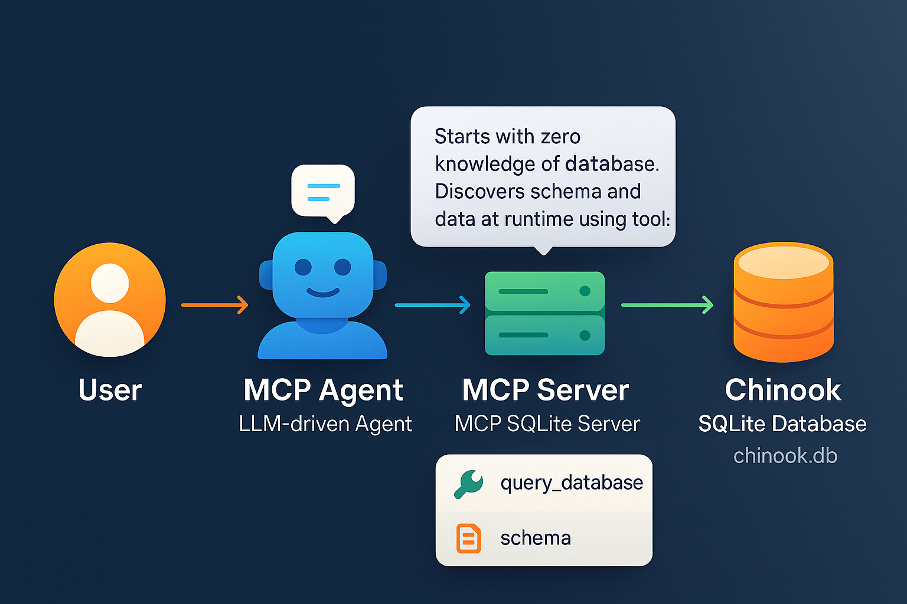

# MCP Intro Project - Chinook Database

**Key Feature: Zero Prior Knowledge Agent**

This project demonstrates a Model Context Protocol (MCP) architecture for natural language database exploration using the Chinook sample database. **The smart MCP agent starts with zero knowledge of the database schema or contents.** It must use only the available MCP tools (such as fetching the schema) to discover the structure and data at runtime, reasoning step-by-step to answer user questions. This approach ensures the agent is general, robust, and adaptable to any database exposed via MCP, not just Chinook.



## Architecture Overview

This project demonstrates a Model Context Protocol (MCP) architecture for natural language database exploration using the Chinook sample database. The system consists of:

- **MCP Server** (`mcp_sqlite_server.py`): Exposes the SQLite database and tools (such as `query_database`) to MCP clients via the MCP protocol.
- **MCP Agent** (`mcp_sqlite_agent.py`): A smart conversational agent that uses an LLM (OpenRouter) to interpret user questions, plan tool calls, and answer using the MCP server.
- **Database**: The Chinook SQLite database (`chinook.db`), a sample music store schema.

### How it Works

- The agent fetches the database schema from the server.
- The user asks questions in natural language.
- The agent uses the LLM to plan and execute tool calls (e.g., generate SQL, run queries) and iterates as needed to answer the question.
- Only the `query_database` tool is exposed, making the agent flexible and LLM-driven.

## Data Source

This project uses the **Chinook Database**, a sample database designed to represent a digital media store. It contains information about artists, albums, tracks, customers, invoices, and more. The Chinook database is widely used for learning and demonstration purposes in SQL and database management.

- **Source:** [Chinook Database GitHub](https://github.com/lerocha/chinook-database)
- **License:** Public domain / open source

### Main Tables

- `Artist`: Music artists
- `Album`: Albums by artists
- `Track`: Individual music tracks
- `Customer`: Store customers
- `Invoice`: Sales invoices
- `InvoiceLine`: Line items on invoices
- `Employee`: Store employees
- `Genre`, `MediaType`, `Playlist`, `PlaylistTrack`: Supporting tables

## Initialization

To set up the database:

1. Run the initialization script:

    ```bash
    python init_chinook_db.py
    ```

2. This will download the Chinook SQLite database file (`chinook.db`) and verify its structure.

## Running the Project

### 1. Initialize the Database

```pwsh
python init_chinook_db.py
```

### 2. Start the MCP Server

**For agent integration (recommended):**

```pwsh
python mcp_sqlite_server.py
```

- This runs the server on http://localhost:8000/mcp using the `streamable-http` transport.
- Required for the agent to connect and interact.

**For debugging and UI exploration (Inspector):**

```pwsh
mcp dev mcp_sqlite_server.py
```

- This launches the MCP Inspector web UI and a proxy server on a random port (e.g., 6277).
- The Inspector is for manual exploration and debugging, not for agent integration.
- The agent will NOT work with the Inspector proxy port.

### 3. Run the MCP Agent

```pwsh
python mcp_sqlite_agent.py [--debug]
```

- Interact with the agent in natural language.
- The agent will plan, call tools, and answer your questions about the database.
- Use the optional `--debug` flag to enable detailed debug output (shows [DEBUG] steps and tool calls).

## Local Development Environment

It is recommended to use a Python virtual environment for local development. To set up and install all requirements:

### Windows (PowerShell)
```pwsh
# Create a virtual environment in the .venv directory
python -m venv .venv

# Activate the virtual environment
.venv\Scripts\Activate.ps1

# Install all required packages
pip install -r requirements.txt
```

### Linux/macOS (bash/zsh)
```bash
# Create a virtual environment in the .venv directory
python3 -m venv .venv

# Activate the virtual environment
source .venv/bin/activate

# Install all required packages
pip install -r requirements.txt
```

This ensures all dependencies are isolated and consistent for your project.

## Debugging and Development

- Use `python mcp_sqlite_server.py` for all agent/LLM integration and automated tests.
- Use `mcp dev mcp_sqlite_server.py` only for manual debugging and schema exploration in the Inspector UI (http://127.0.0.1:XXXX).
- Do not attempt to connect the agent to the Inspector proxy port; it only works with the direct server.

## Key Differences: Server Run Modes

| Command                          | Use Case                | Agent Compatible | Inspector UI |
|-----------------------------------|-------------------------|------------------|--------------|
| python mcp_sqlite_server.py       | Production/Agent use    | Yes              | No           |
| mcp dev mcp_sqlite_server.py      | Debugging/Inspector UI  | No               | Yes          |

## Requirements

- Python 3.12+
- MCP Python SDK (`pip install "mcp[cli]"`)
- OpenRouter API key (for LLM agent)

## Project Files

- `mcp_sqlite_server.py`: MCP server exposing the database.
- `mcp_sqlite_agent.py`: Conversational agent using LLM and MCP tools.
- `chinook.db`: SQLite database file.
- `openrouter_llm.py`: LLM integration for agent planning.
- `init_chinook_db.py`: Script to download and verify the Chinook database.

---
For more details on MCP, see [modelcontextprotocol.io](https://modelcontextprotocol.io/).
